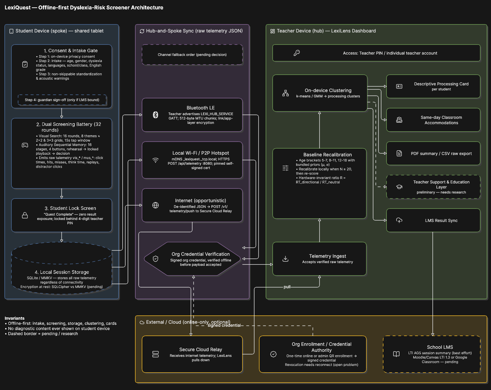

# 2. Architecture

> Milestone M1 · Section C of the M1 technical report.

## C1. System architecture

*Fig. 1. LexiQuest offline-first architecture: student device (spoke), hub-and-spoke sync, and
teacher LexiLens dashboard (hub), with an optional online-only external layer. Dashed borders denote
components pending a decision or blocked on research.*

- **Student device (spoke):** consent & intake gate → dual screening battery (32 rounds) → student
  lock screen → local session storage. Runs fully offline.
- **Hub-and-spoke sync:** Bluetooth LE, local Wi-Fi / P2P hotspot, and opportunistic internet.
  Every payload passes org credential verification before it is accepted.
- **Teacher device (hub), LexiLens:** telemetry ingest → baseline recalibration → on-device
  clustering → processing card, accommodations, PDF/CSV export, teacher support layer, LMS sync.
- **External / cloud (online-only, optional):** secure cloud relay, org enrolment / credential
  authority, school LMS.

Repo mapping: student device → [`apps/lexiquest`](../apps/lexiquest), teacher hub →
[`apps/lexilens`](../apps/lexilens), shared contracts → [`packages/shared`](../packages/shared),
cloud relay → [`relay`](../relay), model analysis → [`ml`](../ml).

## C2. Interfaces

| Interface | What crosses, and in what form | Owner |
|-----------|-------------------------------|-------|
| Student device → Bluetooth LE | Raw telemetry JSON over the `LEXI_HUB_SERVICE` GATT service, 512-byte MTU chunks, link- and app-layer encrypted | Our sync code |
| Student device → Local Wi-Fi / P2P hotspot | Hub found by mDNS (`_lexiquest._tcp.local`); HTTPS POST to `/api/telemetry` on port 8080 with a pinned self-signed certificate | Our sync code |
| Student device → Secure cloud relay | De-identified JSON via POST `/v1/telemetry/push`; LexiLens pulls it later | Our team (relay) |
| Sync layer → Telemetry ingest | Payload accepted only after Org Credential Verification checks a signed organisation credential, offline | Our sync code |
| Org enrolment / credential authority → devices | Signed credential issued by one-time online enrolment or admin QR | Our team |
| Telemetry ingest → Baseline recalibration | Verified raw telemetry; ratios *R* computed and scored against bundled priors (μ, σ) for age brackets 5–7, 8–11, 12–18 | Our code, inside the learned boundary |
| Baseline recalibration → On-device clustering | Standardised ratio vectors | Learned component |
| On-device clustering → outputs | Profile for the descriptive processing card, same-day accommodations, PDF summary, CSV raw export, teacher support layer | Our card code |

**Operational dependencies:** device touch and throttling behaviour; Bluetooth and Wi-Fi permissions
on each device; the teacher's hub device and its battery; the bundled priors; the credential
authority for enrolment and revocation; the secure cloud relay; the school's LMS.

### Failure modes

| Component (Fig. 1) | What fails | How it shows up | How it is detected | What the system does meanwhile |
|--------------------|-----------|-----------------|--------------------|--------------------------------|
| Consent & intake gate | Guardian sign-off (Step 4) only asked when results are LMS-bound, so most children are screened without it | Silent | Count sessions at ingest with no guardian-consent record | Make Step 4 mandatory for every child; block screening until recorded |
| Dual screening battery | Budget tablet or React Native adds timing error, so ratios aren't truly hardware-invariant | Silent: profiles shift | Per-device-model ratio distribution drifts from the fleet at ingest | Flag that device's sessions as not comparable until checked |
| Student lock screen | A pupil guesses the 4-digit teacher PIN | Pupil sees results | Failed PIN attempts counted | Lock after repeated failures |
| Local session storage | Encryption at rest still pending; tablet lost or stolen | Silent: telemetry exposed | Not detected | Choose SQLCipher or encrypted MMKV before the pilot; store only needed fields |
| Bluetooth LE | Transfer interrupted mid-chunk | Session missing or partial | Chunk count and session ID check at ingest | Tablet keeps its copy and retries; channel fallback order still to decide |
| Local Wi-Fi / P2P hotspot | Pinned certificate expires or changes | "Cannot reach hub" | TLS errors logged on the tablet | Fall back to Bluetooth LE |
| Secure cloud relay | Relay down, or LexiLens has not pulled | Dashboard shows older results | Time between session and arrival at hub | Card shows the session date; screening unaffected |
| Baseline recalibration | At N ≥ 20 an unusual cohort skews μ and σ, then earlier children are re-scored | Silent: earlier cards change | Log μ and σ at each recalibration and compare with bundled priors | Hold the old baseline until the teacher confirms; mark re-scored cards "updated" |
| Baseline recalibration | Bundled priors file corrupted or tampered with | Screening unavailable | Signature check fails on load | Refuse to score; never use unsigned priors |
| On-device clustering | A child is unlike every cluster | "No clear pattern" card | Distance to nearest centre above threshold | Defer to the teacher with general tips |

## C3. Data

| Data | Scarcity | Noise | Provenance | Legal status |
|------|----------|-------|------------|--------------|
| Source baseline (DGamesDataSet) | 137 children for 400+ features; high variance | Recruitment and demographic confounds dominate naive models | Collected outside Africa on a fixed device set, under the original researchers' consent | Consent covered research, not our use |
| Local session telemetry | None yet; builds up one class at a time | Shared tablets, distractions, children unused to tablets, touch-latency differences | Our app, on school tablets | Children's data, so special personal data under Act 843 s.37(1)(a); needs guardian consent (s.37(2)(b)) and security safeguards (s.28) |
| Intake data (age, gender, languages, class, English grade, dyslexia status) | Easy to collect | Self- or teacher-reported; ages and grades often approximate | Teacher at the intake gate | As above; "dyslexia status" is also health data. Under minimality (s.19) keep only fields the model or card uses |
| Validation labels | Very scarce: few Ghanaian children have a formal diagnosis | Diagnoses vary by assessor and may reflect language rather than processing | A partner clinic or assessor, if one can be found | Children's health data; needs specific consent and a provider agreement |

The most serious risk is a mismatch between the source population and Ghanaian children, who have a
different language background, school system, and device familiarity.

> **Data handling in this repo:** the DGamesDataSet and any local session telemetry are never
> committed. See [`ml/data/README.md`](../ml/data/README.md).

## C4. Measurement plan

For each major claim: the metric, the ground truth, the acceptable threshold, and the metric's
known weakness. Thresholds marked TBD are open gaps, not invented numbers.

### 1. Clustering / screening validity

| | |
|-|-|
| **Claim** | On-device unsupervised clustering (k-means/GMM) groups children into meaningfully distinct processing profiles that correspond to real dyslexia-risk differences. |
| **Metric** | Adjusted Rand Index (ARI) between cluster assignment and diagnosed label; F1/precision/recall if a supervised comparison runs alongside. |
| **Ground truth** | Rauschenberger et al. DGamesDataSet labels (137 participants: 86 control / 51 diagnosed). |
| **Threshold** | TBD. No local baseline yet; the paper's supervised models reached F1 ≈ 0.75–0.77 on curated feature subsets, our only external anchor. |
| **Known weakness** | N = 137 is small for 400+ features: high variance, real overfitting risk. Our re-analysis found a naive full-feature model's skill is dominated by demographic/recruitment confounds (F1 0.64 from demographics alone). Every reported number must state its feature subset. |

### 2. Hardware-invariance assumption

| | |
|-|-|
| **Claim** | Ratio features (e.g. R = RT_directional / RT_neutral) cancel device-speed differences. |
| **Metric** | Variance of each ratio across simulated/measured device-speed tiers (inject artificial input lag; compare ratio stability vs. raw-timestamp stability). |
| **Ground truth** | A synthetic timing-jitter test harness we build ourselves; the source dataset used a fixed device set. |
| **Threshold** | TBD. Proposed: ratio variance across tiers meaningfully lower than raw-timestamp variance; exact delta undefined. |
| **Known weakness** | Inherited design assumption, not yet tested on budget Android tablets or in React Native specifically (the open "RN timing-precision spike"). |

### 3. Sync reliability (hub-and-spoke)

| | |
|-|-|
| **Claim** | Telemetry reaches the LexiLens hub intact across BLE, local Wi-Fi, and internet, without loss or duplication. |
| **Metric** | % of sessions with zero missing fields post-sync; % of sessions duplicated at the hub. |
| **Ground truth** | Local harness: interrupt sync mid-transfer on all three channels and compare hub record to the on-device source of truth. |
| **Threshold** | TBD. Proposed ≥ 99% field-completeness for successful syncs, 0% silent duplication; not yet agreed. |
| **Known weakness** | Catches missingness and duplication, not silent corruption. A checksum-based test would be needed and is out of scope for M2. |

### 4. Security controls

| | |
|-|-|
| **Claim** | Telemetry is encrypted at rest and in transit; sync only succeeds within one organisation. |
| **Metric** | Pass/fail: (a) can a pulled `.db`/MMKV file be read without the key? (b) can a sniffer on the same Wi-Fi read a BLE/local-Wi-Fi payload in plaintext? (c) is a cross-org sync attempt rejected? |
| **Ground truth** | Manual penetration-style test. |
| **Threshold** | All three must be a hard pass. |
| **Known weakness** | Proves the mechanism works as designed, not that the credential/revocation model (R7/R8) holds over time. A device offline for months with a valid cached credential is a known, unresolved gap. |

### 5. Teacher support & recommendation quality

| | |
|-|-|
| **Claim** | Accommodation cards and (future) exercise recommendations help a teacher act appropriately. |
| **Metric** | None defined yet. |
| **Ground truth** | Blocked on research (R1–R3, R5). Likely needs our own small teacher-facing user study. |
| **Threshold** | N/A |
| **Known weakness** | Named as unmeasured rather than using a proxy (e.g. "teacher clicked the card") that would look measured but not indicate what we care about. |

### 6. App performance

| | |
|-|-|
| **Claim** | The app performs acceptably on budget classroom hardware. |
| **Metric** | Cold-start time (ms), on-device clustering latency (ms), battery % per full 32-round session. |
| **Ground truth** | Direct measurement on target-tier devices, once a minimum device baseline is chosen. |
| **Threshold** | TBD; see [open decisions](04-open-decisions.md). |
| **Known weakness** | Without an agreed device baseline, "acceptable" has no fixed target. |

## C5. Misuse

| What someone could do | What would catch or minimise it |
|-----------------------|---------------------------------|
| A student plays another student's quest | Cannot be fully caught technically; the teacher must supervise |
| A teacher coaches students or replays until results look better | Count and show replays per child on their card |
| A school uses results to stream children into classes | Not detectable in software; prohibited in our terms of use |

## C6. How our framing changed

1. Re-analysing the source dataset showed demographics alone reach F1 = 0.64. We stopped treating
   the published 0.75–0.77 as evidence that behaviour carries the signal, and committed to beating
   the demographics baseline.
2. The Level 1 z-score is a statistical approach rather than ML. We keep it as the fallback for the
   Level 2 clustering approach.

**Use of AI tools:** AI assistants helped structure Sections B and C and suggest examples (e.g. for
failure modes). Every team member reviewed the text and rejected suggestions we did not agree with.
